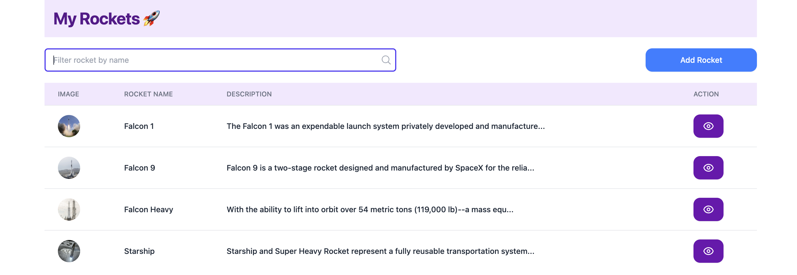
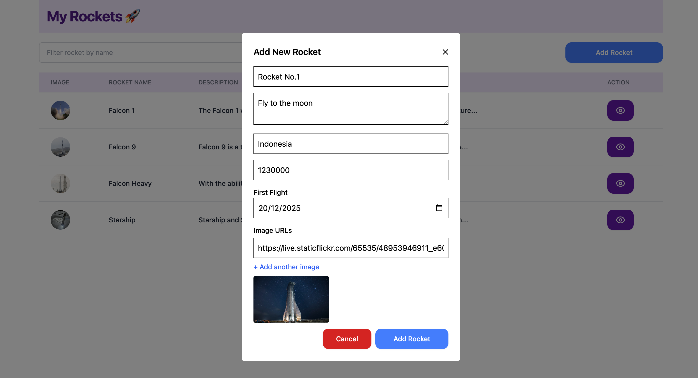

# React + TypeScript + Vite
- React Typescript
- Tailwindcss
- Zustand
- React Router Dom
- Axios
- React Hot Toast

## Installation
- init new react project
```terminal
npm create vite@latest
```
- 3rd Party
```terminal
npm install --save-dev --save-exact prettier
```
```terminal
npm install tailwindcss @tailwindcss/vite
```
```terminal
npm install react-router-dom axios zustand react-hot-toast
```

## Run Project
```terminal
npm run dev
```

## API Usage
https://api.spacexdata.com/v4/rockets

## Feature
- `Rocket List Page` (display list of rockets, function filter, function detail, function add rocket)


- `Add Rocket Modal` (input form rocket, adding image list, preview image, guard date)


- `Rocket Detail Page` (display detail of rockets, carousel image, back to rocket list)
